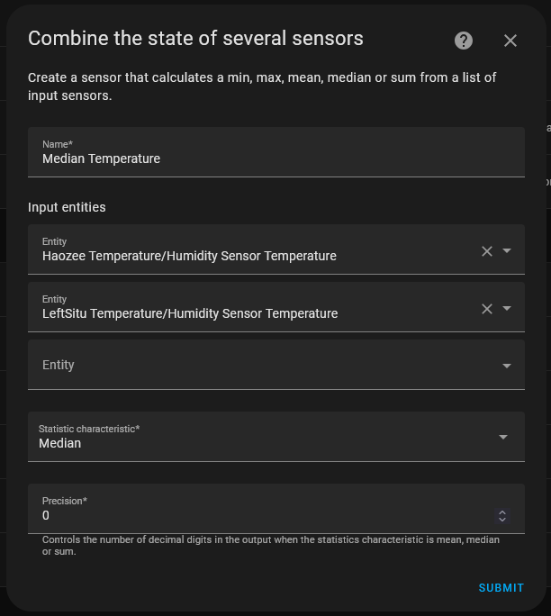

# Controlling climate in Home Assistant with the temperature sensor

Using the temperature sensor data, I showed you how to create a combined sensor representing the median temperature and used it to automatically adjust the thermostat to be within a range in [this segment of the video](https://www.youtube.com/watch?v=9C3O-FpfVZY&t=400s).

You can view the YAML configuration of all helpers and the automation [here](hvac_control.yml).

## Creating the Median Temperature sensor

1. In your Home Assistant UI, go to `Settings`
1. Go to `Devices & Services`
1. Click on `Helpers` at the top
1. Click on the `+ Create Helper` button at the bottom right
1. Choose the `Combine the state of several sensors` option
1. Set the helper values to: 

## Creating the helpers

You'll need to create two helpers: one for the upper range and one for the lower range.

1. In the same Helpers tab, click on the `+ Create Helper` button at the bottom right
1. Choose the `Number` option
1. Set the helper values to: 
1. Create another helper for the lower range: 
1. In the Helpers tab, click on each of the helpers and set your range.

## Finding your thermostat's temperature sensor

For the automation, we'll need to know your thermostat's temperature so we can adjust the set temperature accordingly. 

1. From Settings, go to `Devices & Services`
1. Find the integration you setup for your thermostat and click on the blue link under it. I have a Nest thermostat, so mine is listed under the Google Nest integration. 
1. On the devices page, you should see a section for `Sensors` and there should be a temperature sensor. Click on it. 
1. Click on the cog icon at the top of the modal
1. Copy on the copy button for the `Entity ID` field. Should be something like `sensor.thermostat_temperature`. 

## Creating the automation

1. From Settings, go to `Automations & Scenes`
1. Click on the `+ Create Automation` button at the bottom right
1. Choose `Create new automation`
1. Click on the `+ Add Trigger` button
1. Choose `Entity` and then `Numeric State`
1. Set the trigger values to: 
1. Click on the `+ Add Building Block` button and choose `Choose`
1. Click on the `+ Add Option` button
1. Click on the `+ Add Condition` button
1. Set the condition values to: 
1. Click on the `+ Add Action` button
1. Choose `Climate` and then `Set Target Temperature`
1. Click on the kabob icon at the top right and select `Edit in YAML`. (It looks way scarier than it is.)
1. Add the template found in [this file](hvac_control.yml) (look for `# UPPER RANGE TEMPERATURE TEMPLATE`) so that it looks like this: 
1. We'll repeat the option process for the lower temperature with the trigger's upper limit being based on your lower range helper and the action coming from [this file](hvac_control.yml) under the `# LOWER RANGE TEMPERATURE TEMPLATE` comment.
1. Click on the `Save` button and name your automation
