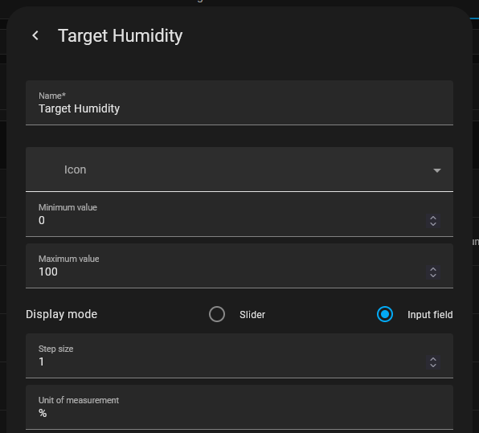
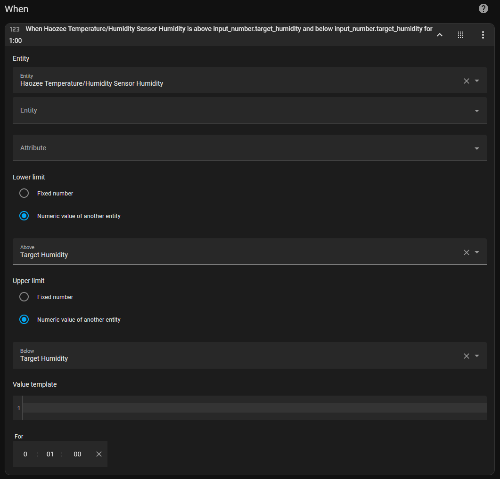
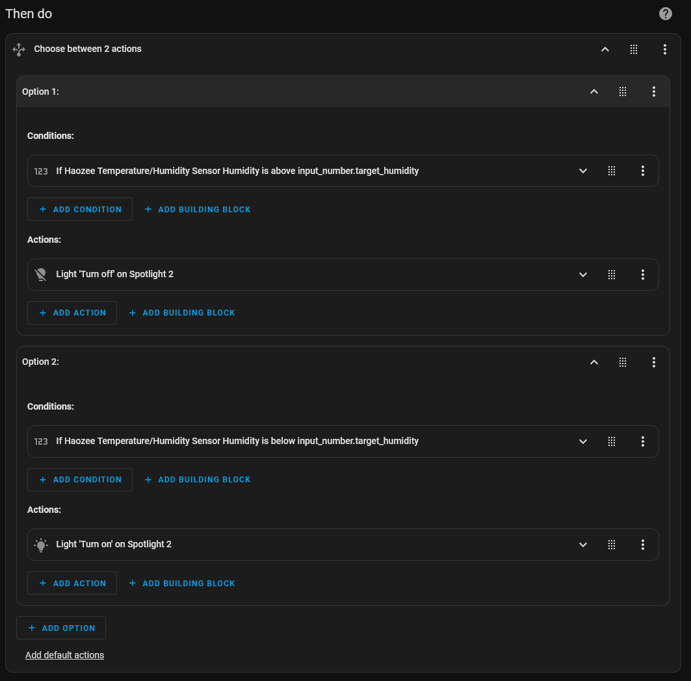

# Episode 1: Temperature and Humidity Sensors

These are the show notes for the inaugural video of Home Automation Lab! I review two Zigbee temperature and humidity sensors and show off two ways you can use them in Home Assistant.

[](https://youtu.be/9C3O-FpfVZY)

### Product Links

* [Haozee sensor on AliExpress](https://u.loganbibby.com/haozeetemperaturehumiditysensor)
* [LeftSitu sensor on AliExpress](https://u.loganbibby.com/leftsitutemperaturehumiditysensor)
* [Temperature data logger (used as control) on Amazon](https://u.loganbibby.com/tempdatalogger)

(Some or all of those are affiliate links and I may earn a commission if you purchase.)

### Other Links

* [Spreadsheet of raw data](https://u.loganbibby.com/haltemphumidsensordata)

## Controlling a bathroom exhaust fan with the humidity sensor

Using one of the humidty sensors, I show you how to control a bathroom exhaust fan in [this segment of the video](https://www.youtube.com/watch?v=9C3O-FpfVZY&t=800s). I don't have an exhaust fan hooked up to Home Assistant yet, so I used it to turn on and off a light. 

You'll need to create a helper for specifying the target humidity.



When creating the automation itself, you can reference these screenshots or use the YAML of the automation below. I updated the YAML to turn a switch on and off which should work in most situations. 





```yaml
- id: '1738513256532'
  alias: Turn on exhaust fan based on humidity
  description: ''
  triggers:
  - trigger: numeric_state
    entity_id:
    - sensor.haozee_temperature_humidity_sensor_humidity
    for:
      hours: 0
      minutes: 1
      seconds: 0
    above: input_number.target_humidity
    below: input_number.target_humidity
  conditions: []
  actions:
  - choose:
      - conditions:
          - condition: numeric_state
            entity_id: sensor.haozee_temperature_humidity_sensor_humidity
            above: input_number.target_humidity
        sequence:
          - action: switch.turn_on
            metadata: {}
            data: {}
            target:
              entity_id: switch.socket_3
      - conditions:
          - condition: numeric_state
            entity_id: sensor.haozee_temperature_humidity_sensor_humidity
            below: input_number.target_humidity
        sequence:
          - action: switch.turn_off
            metadata: {}
            data: {}
            target:
              entity_id: switch.socket_3
  mode: single
```

*Remember, you'll need to replace `sensor.haozee_temperature_humidity_sensor_humidity` with the entity ID of your humidity sensor and the `switch.socket_3` with your exhaust fan's entity ID.*